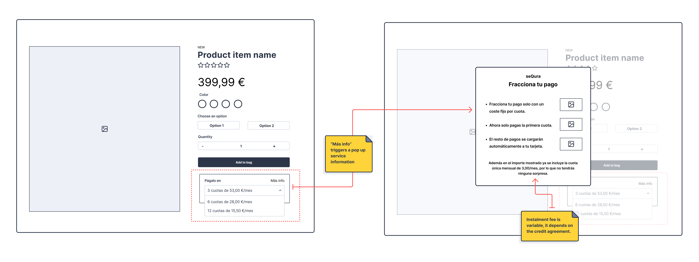

This is the coding challenge for people who applied to a frontend developer position. It's been designed to be a simplified version of the same problems we deal with.

## Context

We provides e-commerce shops with a flexible payment method that allows shoppers to split their purchases in differents installments depending on the product price. In exchange, we earn a fee for each purchase.

This challenge is about implementing a widget in a merchant site demo so the shoppers can select how many instalments they like to pay with.

## Problem statement

We provides e-commerce shops (Merchants) a flexible payment method so their customers (Shoppers) can purchase the goods by paying in instalments. We have analysed, that this kind of payment method requires the biggest effort in promotion by part of the merchant to make a difference in purchases quantity and average amount.

As part of our the product iteration process, the Product Designer from the team has made a wireframe and now is asking you to implement a widget to display the instalments options for a given product, on a merchant page. The Product Designer is also very interested in analysing any shopper interaction with the widget so the team can improve it in future iterations.

We expect you to:

1. Create the prototype for the wireframe that the Product Designer has given you (`wireframe.png`).
   * Integrate the prototype with `CreditAgreementAPI` ([Credit Agreements docs](api/README.md#credit-agreements-api)) to fetch financing information for a given product value.
   * Integrate the prototype with `EventsAPI` ([Events docs](api/README.md#events-api)) triggering an event for each shopper interaction.
2. Integrate the prototype in the merchant sample site (`merchant-site/product-page.html`) so that every time the product price changes the financing value is updated.
3. Write up a paragraph with the way you would distribute this prototype to all our merchants.

_Widget design wireframe given by the Product Designer._

## Instructions

Please read carefully the challenge and if you have any doubt or need extra info please don't hesitate to ask us before starting.
- In order to use the Mocked API you need to start the server found in the folder `api`. More about [Starting the server](api/README.md#starting-the-server).
- Create a **README** explaining:
    1. How to **set up and and run** your solution.
    2. An explanation of your technical choices, tradeoffs, assumptions you took, etc.
    3. If you left things aside due to time constraints, explain why and how you would resolve or improve them.
- You should **consider this code ready for production** as it was a PR to be reviewed by a colleague. Also, commit as if it were a real-world feature.
- **Design, test, develop and document the code.** It should be a performant, clean, and well-structured solution.
- You **shouldn't spend more than 3h** on the challenge.
- Since it's frontend challenge, we expect the code based in JavaScript, but you can code the solution in framework of your choice. Here some technologies we are more familiar (in no particular order): JavaScript, Typescript, React, Web Components.
- Your **experience level will be taken into consideration** when evaluating.

When completed, send a zip with your README and code, including the `.git` folder to see the commit log, to your hiring contact.